# 栖岸城：独居日记

**一个人的日子，也值得认真过。**

一款个人制作的城市生活模拟游戏。你从一间出租屋开始，在工作、吃饭、休息、经营和认识邻居之间，安排属于自己的每一天。可以走一条职业路线，也可以先去河岸钓鱼、逛逛广场，慢慢熟悉这座城市。

**免费试玩 · 中文 · Windows 64 位 · 当前版本 v0.1.1**

[直接下载游戏 ZIP（约 145 MB）](https://github.com/oo22432791-ctrl/qian-city/releases/download/v0.1.1/QianCity-v0.1.1-Windows-x64.zip) · [版本说明与校验文件](https://github.com/oo22432791-ctrl/qian-city/releases/tag/v0.1.1) · [反馈问题](https://github.com/oo22432791-ctrl/qian-city/issues)

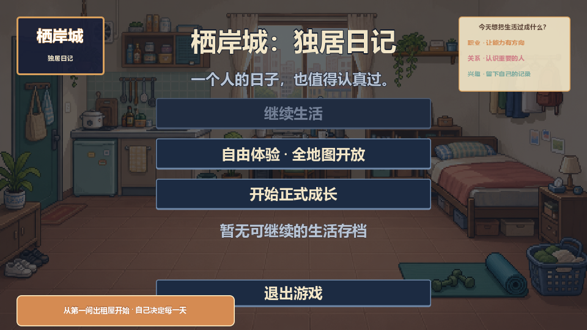

下方截图按玩法分别展示，点击图片可以查看完整原图。

## 在这座城市生活

每个生活日都需要安排体力、健康、心情与现金：今天做多少工作，是否先吃顿饭，要不要去见一个人，什么时候回家休息。回到出租屋，可以使用厨房、整理住处、安排睡前活动，再通过睡眠推进下一生活日。

城市里有广场、河岸、市场、图书馆、艺术街区、山坡和不同的职业场所。地图上的设施对应具体行动；不同地点也会遇到人物、生活插曲与可继续回访的内容。手机集中提供生活、人物、职业和小游戏入口，方便查看下一步方向。

| 从出租屋开始 | 去灯笼广场逛逛 |
| --- | --- |
| 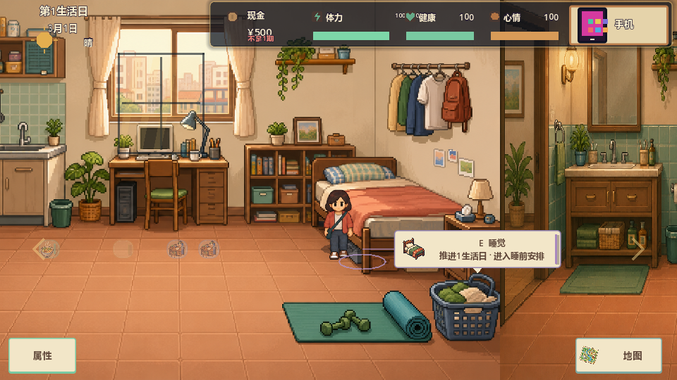 | 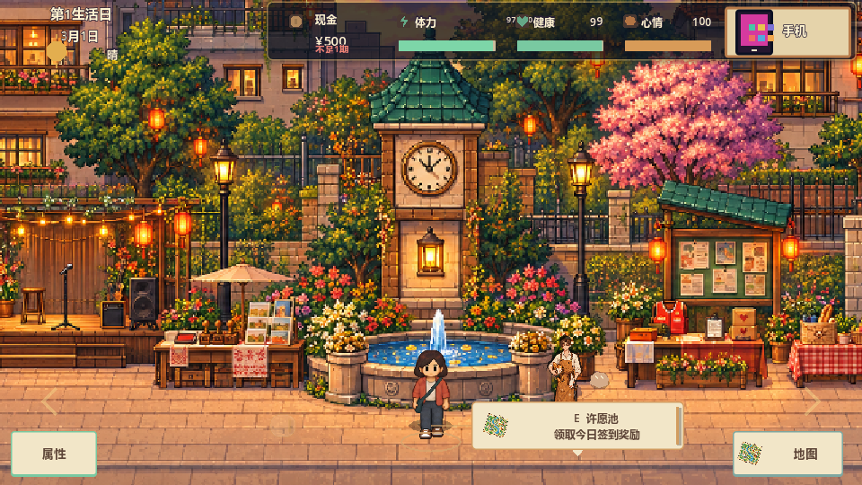 |

## 每条街都有可以停下来的理由

城市探索从寻找一个具体目的地开始。想补充状态时去市场或诊所，想积累职业能力时去图书馆与工作场所，想换换心情时去广场、河岸或山坡。熟悉地图后，也可以把几件事情安排在同一次出行里。

| 地点 | 可以做些什么 |
| --- | --- |
| 灯笼广场 | 参加志愿活动、街头演出、集章与夜市，接触城市里的公共生活 |
| 晨光市场 | 采购食物和补给、逛便利店，为下一轮行动做准备 |
| 回声图书馆 | 学习、阅读、整理资料，寻找职业与人物故事的线索 |
| 浮岛共享屋 | 接触自由职业、短委托与同行交流，也可以去咖啡馆歇一会儿 |
| 风栖山坡 | 园艺、放风筝、观星和投篮，让忙碌的一天留出户外时间 |
| 南湾码头 | 找零工、拍照、骑行、夜跑，查看城市换乘 |
| 旧屋巷 | 认识邻居、修复旧物，进入游戏角体验原潮荣耀 |
| 青禾诊所街 | 恢复身体状态，参与社区服务相关活动 |

部分活动需要达到职业、关系或生活进度条件，天气也会影响当天适合做的事情。自由体验可以先浏览全地图；正式成长则适合体验逐步取得进入资格的过程。

| 晨光市场 · 采购与补给 | 回声图书馆 · 学习与资料 |
| --- | --- |
| 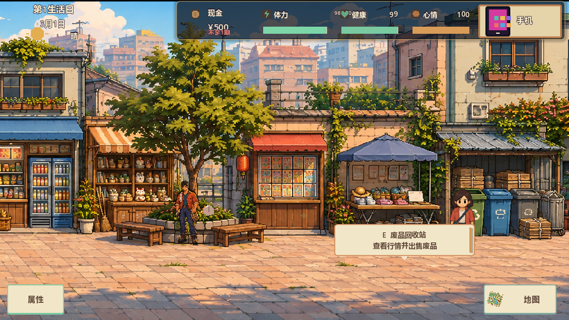 | 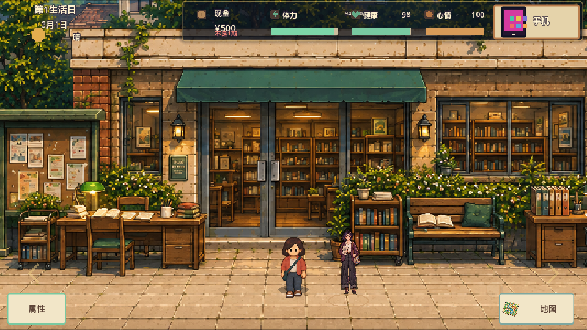 |

| 浮岛共享屋 · 咖啡与协作 | 风栖山坡 · 户外活动 |
| --- | --- |
| 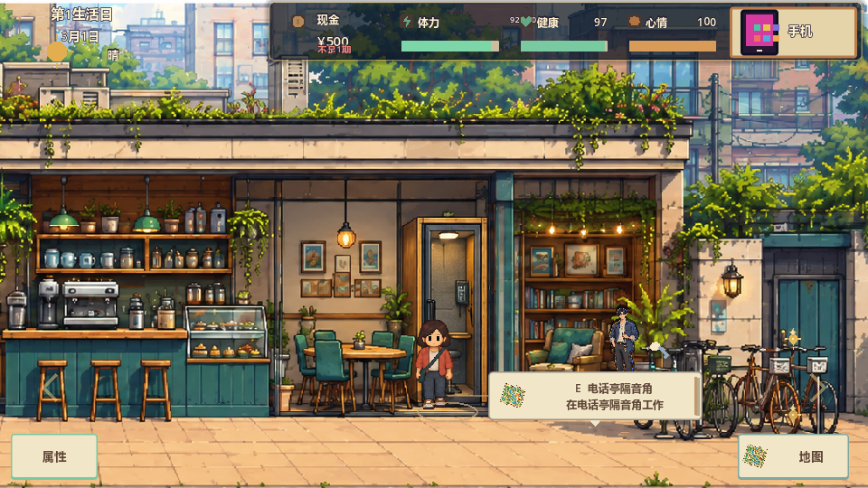 | 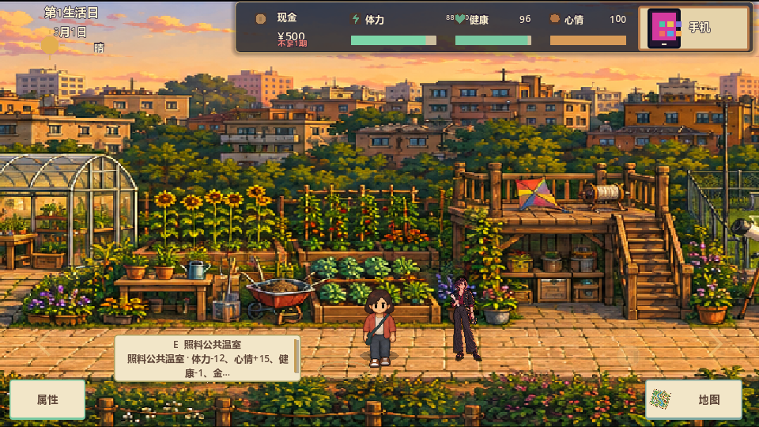 |

## 把住处慢慢变成自己的家

回家以后，厨房、冰箱、工作桌、床铺和卫浴都有各自的用途。你可以采购食材，按食谱做饭，查看库存，再决定今天把多少资金留给生活补给。厨房储备跟随对应住所保存，换一个住处也需要重新考虑自己的生活安排。

家具提供了持续经营的目标。挑选并布置家具，会改变住所里的可用设施和休息收益；不同家具的用途、价格与效果可以在购买时查看。出租屋、晴川公寓、花庭公馆与澄曜复式，也有不同的空间布局与居家行动。

当资金与条件允许时，可以考虑购置住宅、改善居住条件。也可以继续住在熟悉的出租屋，把收入优先用于职业设备、田地或其他成长方向。决定下一笔钱花在哪里，是生活经营的一部分。

| 厨房 · 食材与食谱 | 家居 · 家具位置与效果 |
| --- | --- |
| 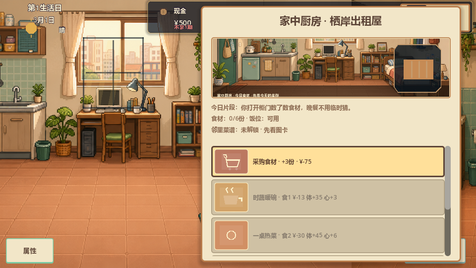 | 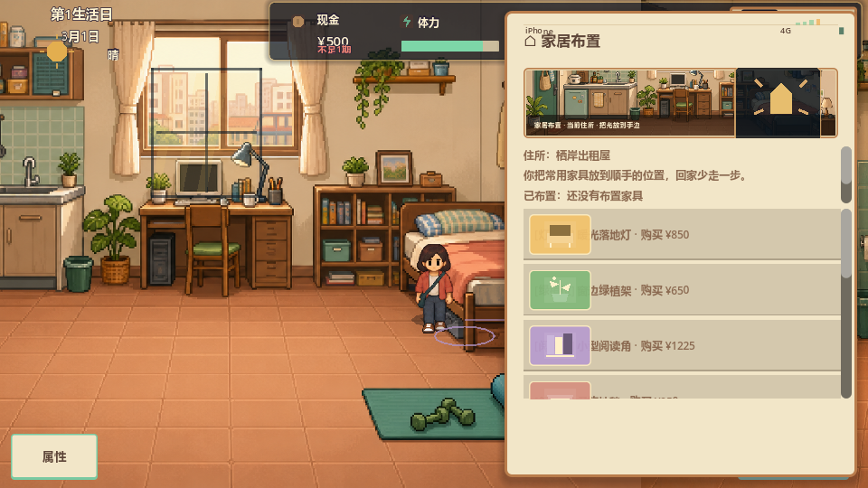 |

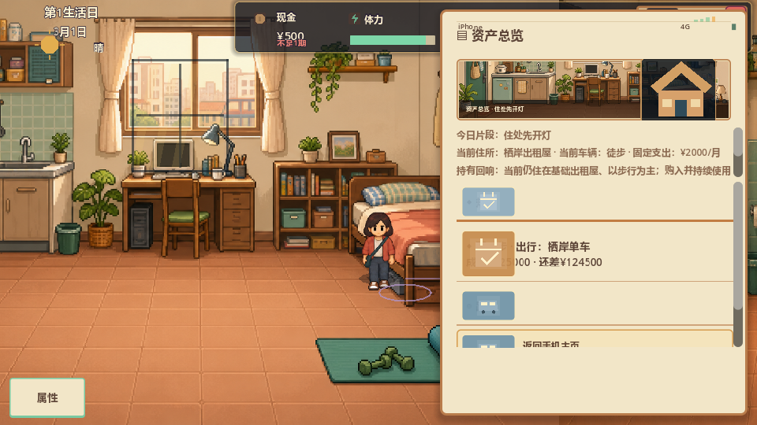

## 今天的天气，也是今天的计划

城市会随生活日呈现季节与天气变化。出门前看看预报，可以帮助你决定先去室内学习，还是把户外活动留到更合适的时候。天气会进入出行、部分活动与农场照料的安排，准备雨具和设备也有实际用途。

白天把事情安排好，晚上再通过睡前活动与睡眠收尾。睡眠推进生活日，并连接恢复状态、作物成长和次日安排；正在经营田地时，记得留意成熟时间，再回到农场完成收获与出售。

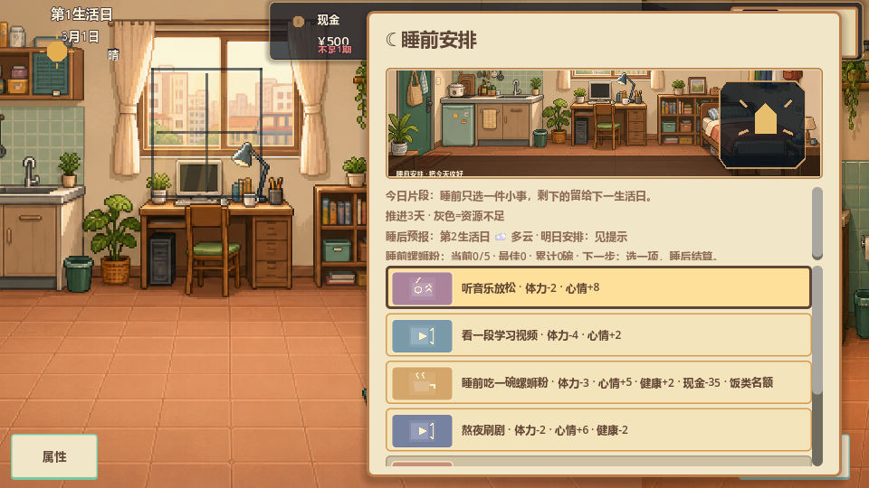

## 四条职业路线，四种生活节奏

各职业拥有独立等级与经验。选定一个方向后，通过它对应的行动、订单或经营逐步成长；切换路线时，各自的进度保留。

| 职业 | 从哪里开始 | 可以逐步体验的内容 |
| --- | --- | --- |
| 务农 | 职业农场的第一块田地 | 播种、照料、收获与出售，积累资金后扩展经营 |
| 游戏从业者 | 旧屋巷的网吧与游戏练习 | 陪练、代打、直播、团队与游戏公司相关内容 |
| 考公 | 回声图书馆的学习与资料整理 | 备考、模拟考试、面试与公共事务 |
| UI设计师 | 灰街艺墙的创作与设计订单 | 作品积累、商业页面、品牌项目与设计委托 |

工作之外，住房、生活支出、设备与关系也会影响安排。现阶段各路线的收益和成长节奏仍在调整，欢迎反馈哪条路线最有趣、哪里容易失去方向。

| 职业路线 · 四条成长方向 | 公共事务局 · 考公后的职业场所 |
| --- | --- |
| 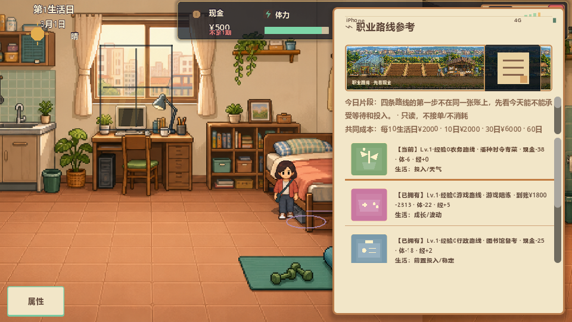 | 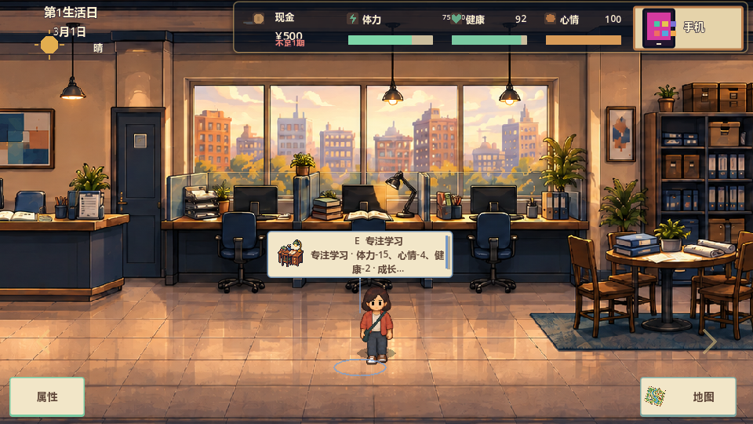 |

| 潮汐游戏公司 · 团队与工位 | 留白设计事务所 · 设计与评审 |
| --- | --- |
| 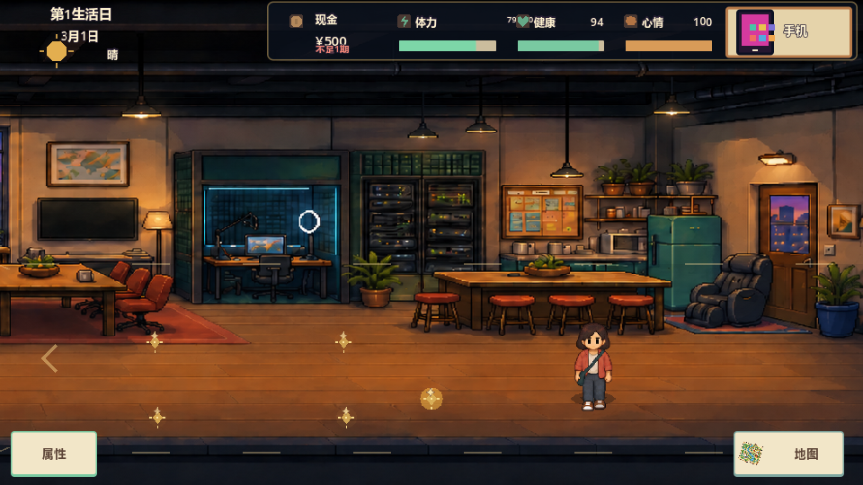 | 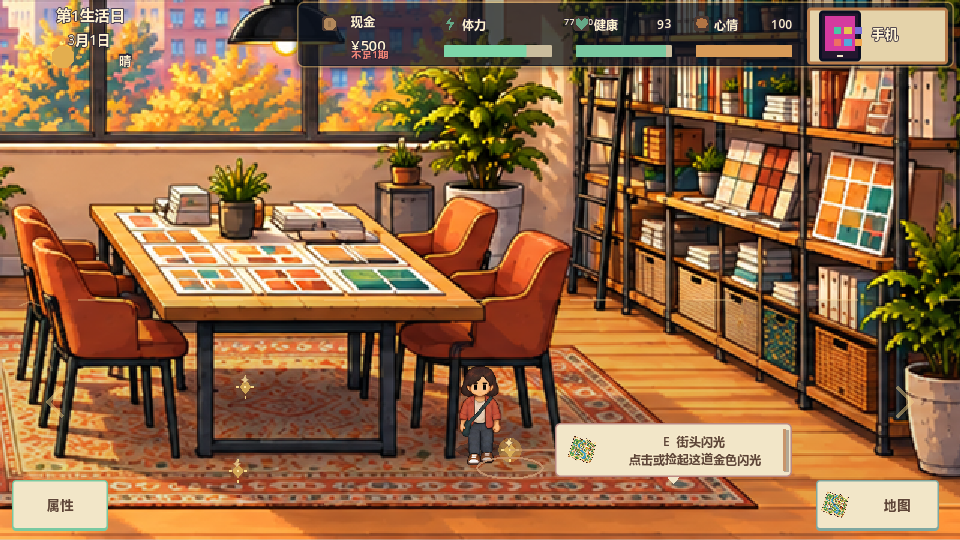 |

## 从一块田地开始经营

职业农场初始开放一块地，其余两块需要花钱解锁。到对应田地播种、浇水或施肥，等待作物成熟，收获后出售；作物、天气与资金安排共同构成经营节奏。

农场不是一个点击就领工资的入口。投入种子、照料作物、推进生活日，再把收成卖出去，才完成一轮经营。截图展示了播种、浇水后的田地和仍未解锁的地块。

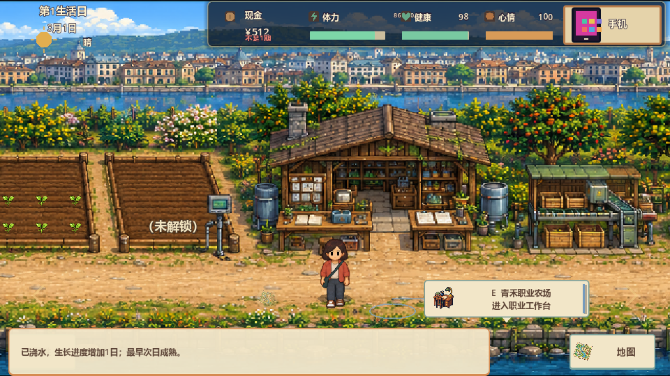

## 在雾河岸慢下来

河岸可以探索、遇见人物，也有独立的钓鱼玩法。准备阶段选择已开放的水域、鱼饵和落点；抛竿需要掌握力度，咬钩时及时扬竿，挂鱼后再通过收线与放线控制张力。

鱼会挣扎，拉得太紧可能断线，放得太松可能脱钩。一行最多三竿，鱼获会记录种类与最大重量，并参与城市收益结算。鱼类图鉴、水域解锁和钓具让钓鱼有可以继续追求的目标。

| 雾河岸的城市场景 | 钓鱼的水域、落点与鱼饵选择 |
| --- | --- |
| 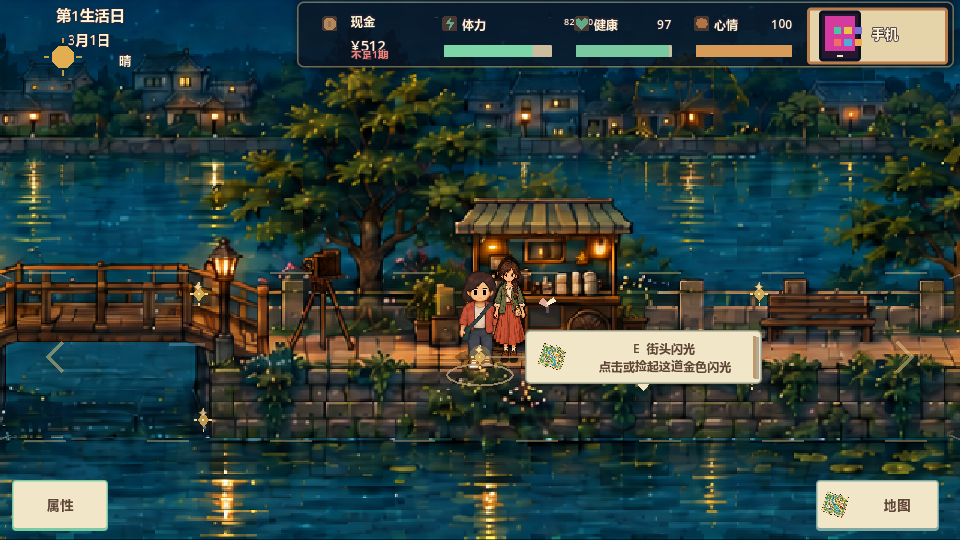 | 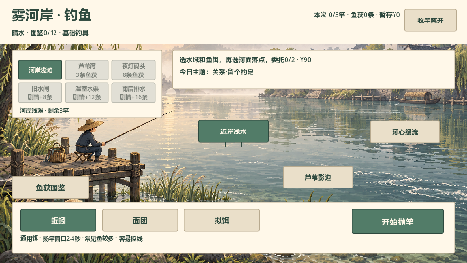 |

## 原潮荣耀：可以长期投入的游戏内游戏

原潮荣耀提供等级成长、招式搭配、专精、四槽装备、章节副本、排位和多轮赛事。通关章节获得经验和材料，再选择装备、强化与配招，挑战更高阶段；旧章节也可以继续用于积累资源。

大厅展示当前状态与下一目标，养成页可以比较装备并手动更换。战斗需要观察对手意图，选择进攻、防御和技能。比赛成绩还会与游戏相关职业的部分收益形成联动，让这个玩法进入城市生活的成长过程。

以下为 **35级展示进度**，用于展示养成页面和后期目标。

| 成长大厅与下一目标 | 装备对比、兑换和强化 |
| --- | --- |
| 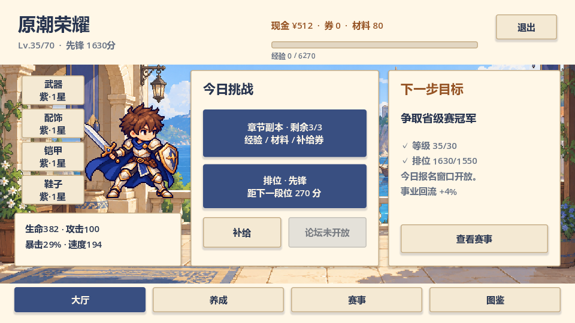 | 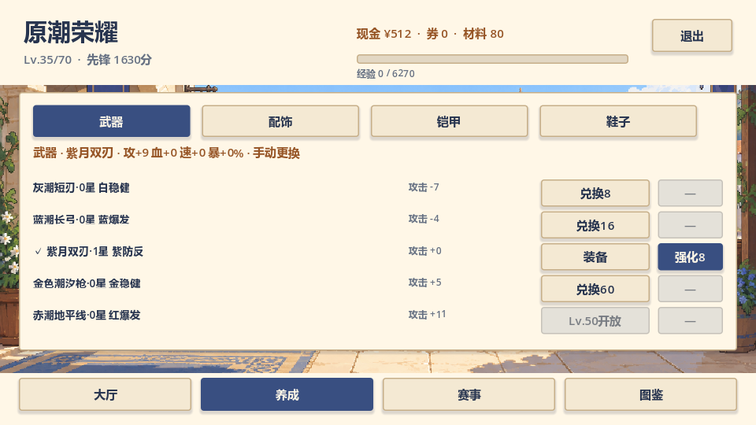 |

## 不赶进度时，还能玩些什么

钓鱼与原潮荣耀之外，城市还有适合短暂休息的独立小游戏。可以选择自己喜欢的一项重复体验，逐步熟悉规则、积累记录，再回来处理当天的其他事情。

| 玩法 | 一局里需要做的选择 |
| --- | --- |
| 城市骑行 | 选择路线，观察四段路况，在不同骑行节奏间切换，争取连击与更好成绩 |
| 城市夜跑 | 根据街道路况选择稳步、绕开或冲刺，在分数与体力消耗之间取舍 |
| 放风筝 | 看当前风向选择控风动作，完成四回合，收集城市风筝卡 |
| 空场投篮 | 根据篮筐距离选择投篮动作，完成四回合，积累球场票根 |
| 园艺 | 体验种植与照料，把收获放进日常成长安排 |

这些玩法会留下成绩、收藏或进度，也会与城市的状态和结算相连。部分玩法按生活日限制次数，结束后可以查看结果，再决定继续探索还是回家休息。

| 城市骑行 · 观察路况选节奏 | 城市夜跑 · 选择稳步、绕开或冲刺 |
| --- | --- |
| 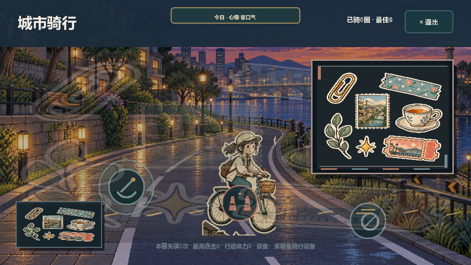 | 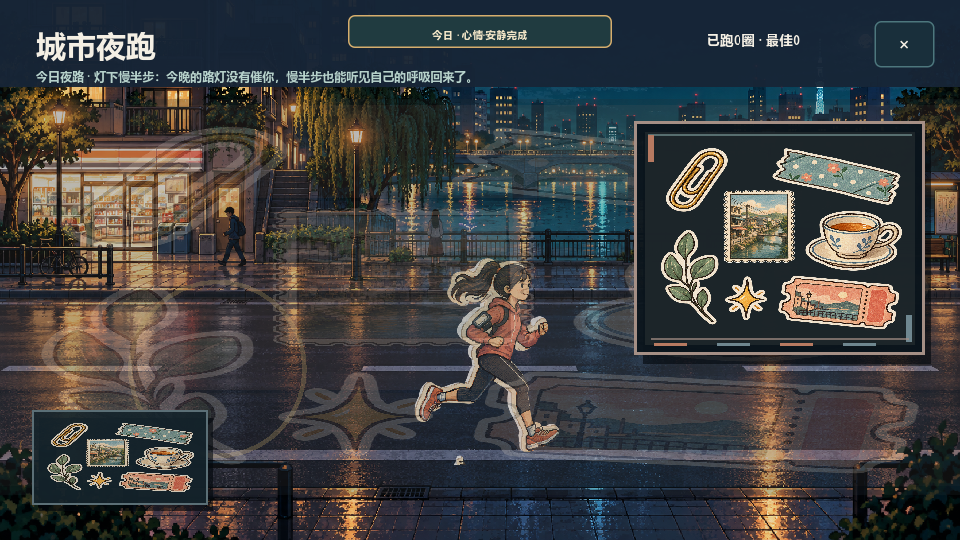 |

| 放风筝 · 根据风向控风 | 空场投篮 · 根据距离选动作 |
| --- | --- |
| 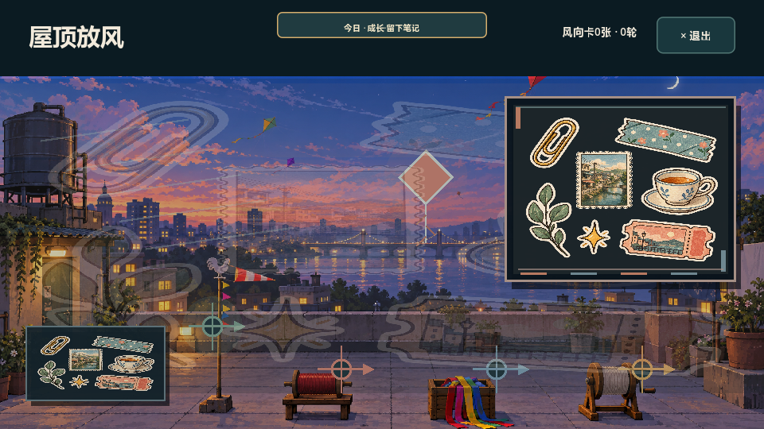 | 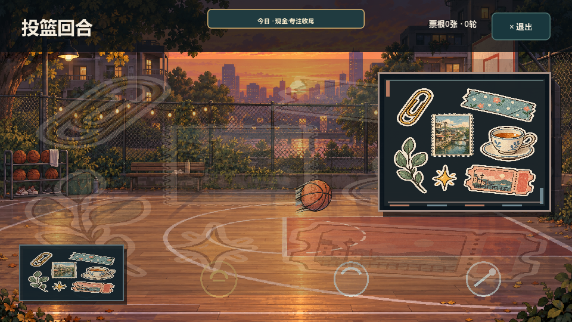 |

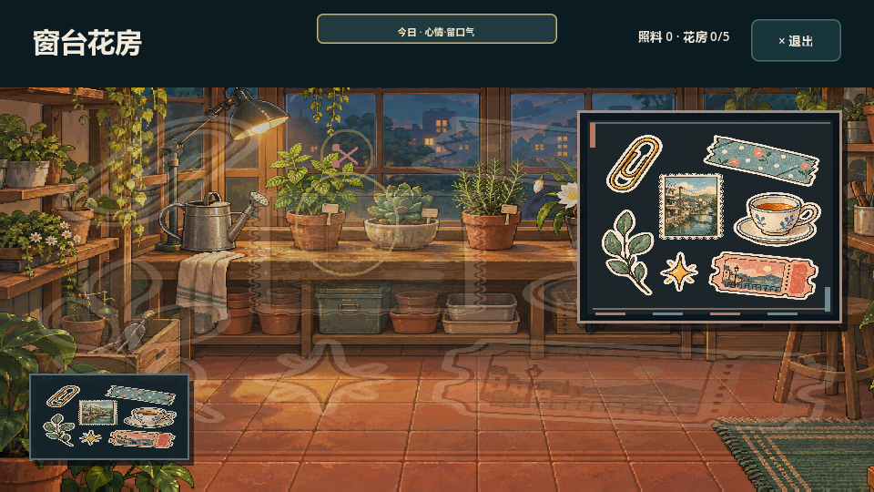

## 给猫咪留一个回家的位置

城市里的流浪猫阿喵也有自己的陪伴过程。先通过回访与互动积累熟悉度，再为家里准备猫爬架；满足条件后，可以正式把它带回家。

收养后，住所会出现猫咪陪伴入口。每天回家照料它，或在家里睡觉，都能获得相应的生活恢复。随着陪伴进度增加，街角的一次相遇会成为住处里持续存在的日常。

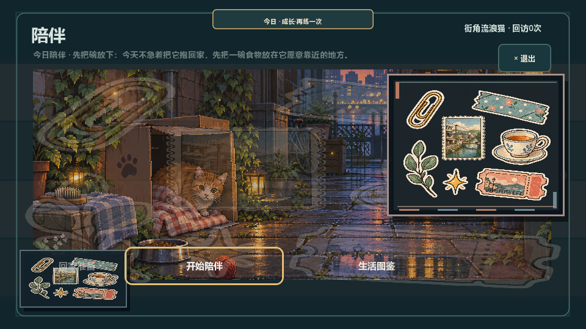

## 人与生活会留下记录

与邻居交流、赠送礼物、参与人物故事和约会，关系会逐步发生变化。生活插曲中的选择、职业经历与一些城市回访会留下记录，可以通过手机回看。

这份作品希望让经营与成长有日常生活的落点：记得自己住在哪里，熟悉某条街，知道下次想见谁，也能决定把钱与精力花在哪件事上。

人物交流也有可以继续跟进的事项。手机联系人里能查看相处进展、尚未完成的约定，以及下一次见面方向。人物故事中的选择会留下不同回应，一些完成后的影响还会进入经营、生活或后续回访。

例如，带回家的旧台灯、一次电台来电、市场里的一次采购，都会让普通的出行多一段记忆。有的选择可以立即看到结果，有的会在之后的生活日留下新的行动入口，值得再去原来的地方看看。

| 关系图鉴 · 认识城市人物 | 相处进展 · 查看未完成事项 |
| --- | --- |
| 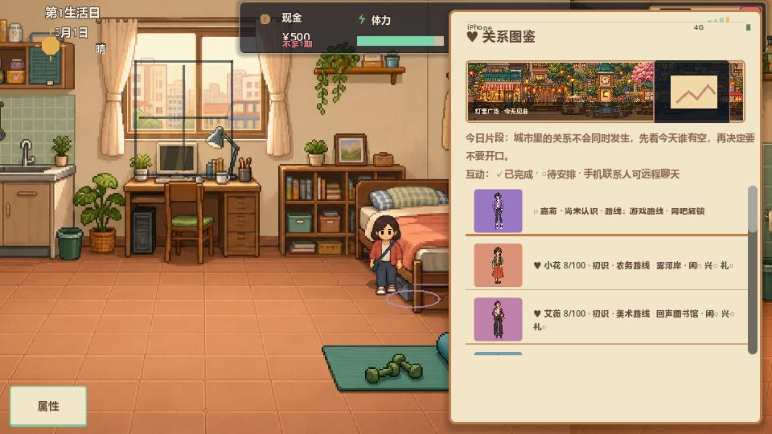 | 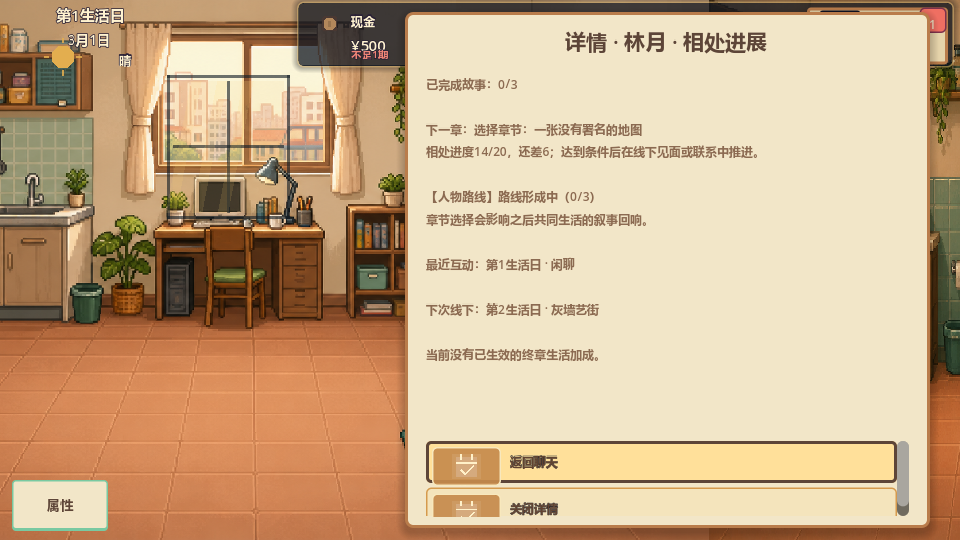 |

## 给自己定一个阶段目标

试玩时可以先选一个容易观察进展的目标，再逐步拉长自己的计划：

- **安顿下来**：熟悉补给、厨房、床铺与手机，完成一个能顺利收尾的生活日。
- **赚到一笔自己的钱**：完成职业行动或短委托，务农则体验一次播种到出售的完整周期。
- **做一次有用的投入**：为家里添置家具、改善设备，或攒钱解锁更多田地。
- **熟悉一个人或一种玩法**：跟进人物故事与约定，或在钓鱼、骑行等玩法中积累自己的记录。
- **继续向后成长**：提升职业等级、接触更高阶段内容，在原潮荣耀里推进章节、装备与赛事目标。

手机里的生活规划、职业履历、生活记录，以及成就和结局图鉴，可以帮助你回看已经做过的事、寻找接下来想达成的条件。游戏中的成就与结局有各自要求，是否追求它们，可以按自己的节奏决定。

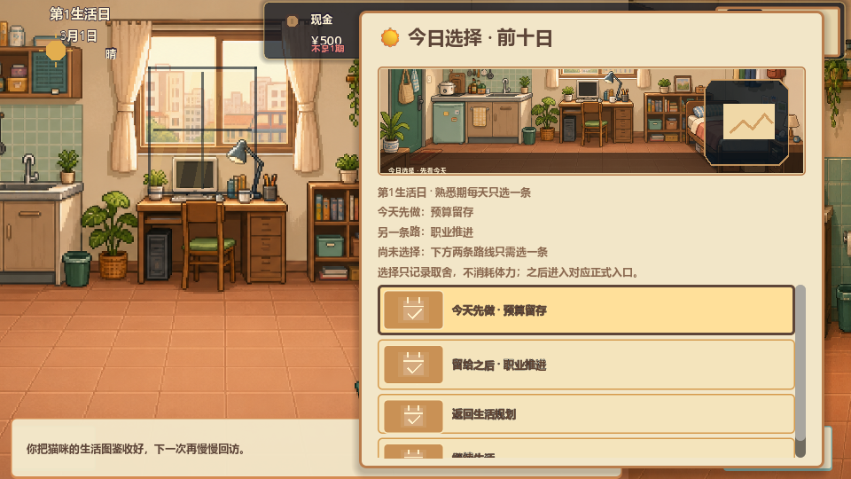

## 第一次试玩怎么开始

两种入口使用同一个存档槽，开始新生活前会提示是否覆盖。

| 入口 | 适合的体验 |
| --- | --- |
| 自由体验 · 全地图开放 | 先看地图、美术和不同玩法，了解城市内容 |
| 开始正式成长 | 按职业等级、资金和资格逐步解锁，体验生活经营的压力与目标 |
| 继续生活 | 读取上次保存的进度 |

建议先熟悉出租屋的床铺、手机和地图，再按所选职业去对应地点完成一次行动。务农可以播种并浇水，回家睡觉推进生活日，再回来查看作物。想放松时，可以去雾河岸钓鱼或打开原潮荣耀。

| 创建角色 · 开始一段生活 | 手机主页 · 找到常用入口 |
| --- | --- |
| 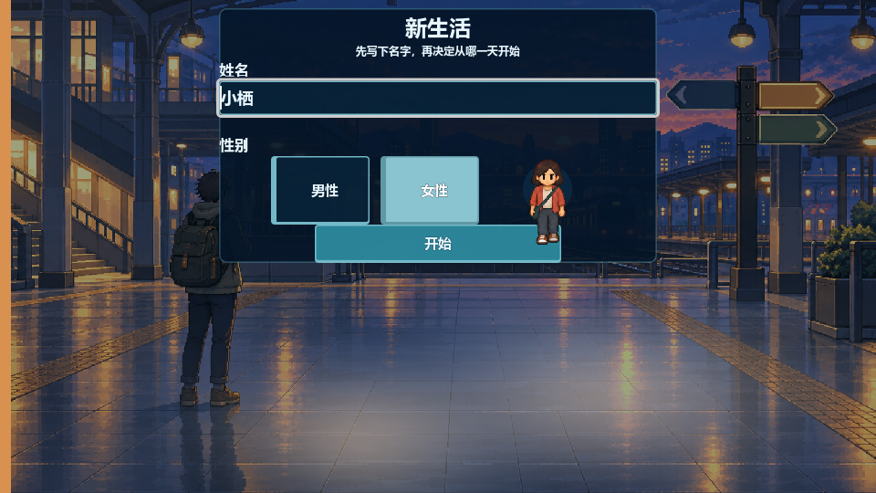 | 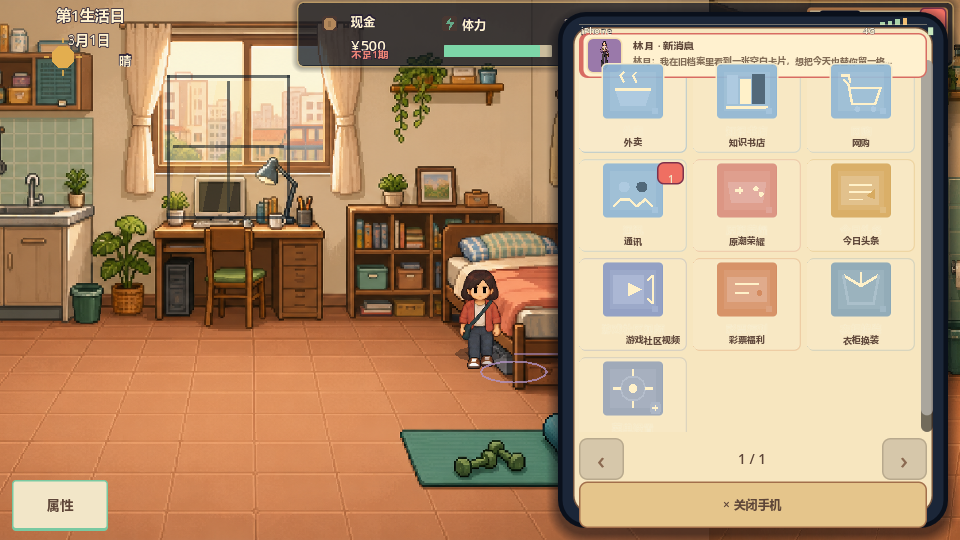 |

## 下载与运行

1. 下载 **QianCity-v0.1.1-Windows-x64.zip**，完整解压到一个文件夹。
2. 双击 `QianCity.exe`。无需安装 Godot，也不需要联网。
3. 保持 `QianCity.exe` 和 `QianCity.pck` 在同一文件夹。

GitHub 自动生成的 Source code 压缩包只包含此仓库的说明和截图；可运行游戏请下载上方 Windows ZIP。

### 基本操作

| 按键 | 操作 |
| --- | --- |
| WASD / 方向键 | 移动 |
| E | 靠近目标后交互 |
| I | 背包 |
| M | 地图 |
| K | 属性 |
| P | 手机 |
| Esc | 返回、关闭普通弹窗或打开系统菜单 |
| 鼠标 | 按钮、选项与列表滚动 |

生活插曲需要完成一次选项选择。钓鱼与原潮荣耀的操作提示会显示在各自界面中。

### 存档与备份

游戏在稳定操作完成后自动保存。存档目录为：

`%APPDATA%\Godot\app_userdata\栖岸城：独居日记`

备份时复制整个文件夹，核心存档与城市存档一起保留。若玩过同名开发版，会读取同一存档目录。不要把本版本写入的存档交给更早版本读取。

## 当前试玩状态

这是个人作品的预发布版。已检查启动、角色创建、农场经营、存档重启及备份恢复，尚未把所有后期路线从头打通。职业收益、成长速度与部分界面仍会调整，仅在当前 Windows 电脑验证运行。

游戏公司和设计事务所的全城碰撞/交互审计仍有未通过项，完整资产检查也有购车样本未通过；本版暂未修复。此包不支持 Android、macOS 或 Linux，程序未做商业代码签名。

欢迎通过 [Issues](https://github.com/oo22432791-ctrl/qian-city/issues) 反馈问题，注明版本、地图/页面、操作步骤、预期和实际结果。启动问题请附 Windows 版本、显卡与是否完整解压。喜欢哪些玩法、第一次不知道该做什么，也很有帮助。

## 截图与资源说明

本页31张截图均来自 v0.1.1 试玩包的实际渲染。城市截图使用独立的自由体验存档，原潮荣耀使用35级展示进度；不同玩家的时间、状态、人物与解锁进度可能不同。

游戏包内附有资源鸣谢、Godot 引擎及第三方许可文件。
